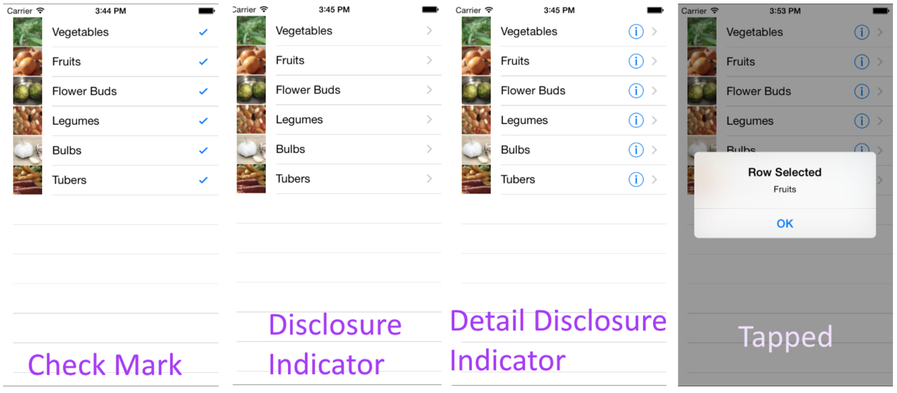
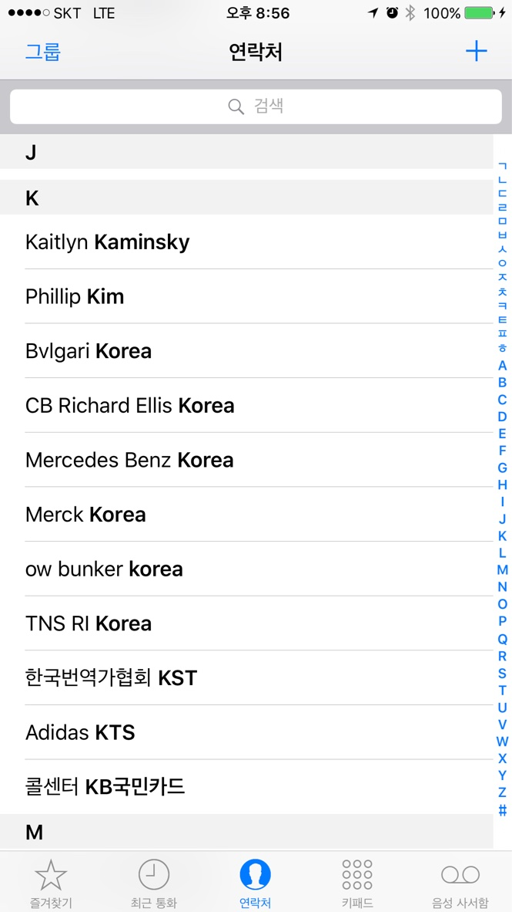
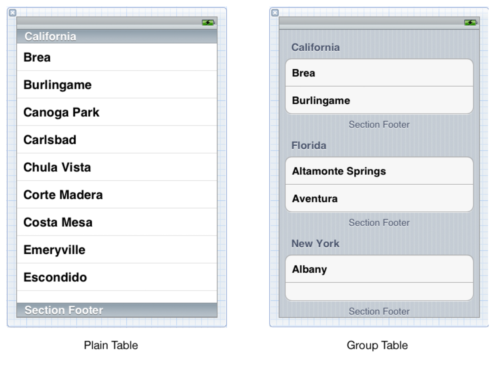

# 6주차 정리  

----

## UITableView

#### Overview 

- 정보를 계층별로 표시하며 해당 정보를 선택하여 편집할 수 있는 기능을 지원한다.  

- 하나의 칼럼(column)에 여러 개의 아이템들로 구성된 리스트를 표시하며, UIScrollView를 상속받는 subclass이며 위아래 스크롤 기능만 지원한다.

- 해당 테이블의 개별 아이템으로 구성된 셀들을 UITableViewCell object들로 지칭하며, UITableView 는 테이블에 보여지는 row(행)들을 표시하기 위해 UITableViewCell object들을 사용한다.

- 각 셀에는 타이틀과 이미지가 포함되고 오른쪽 맨 끝에 accesory view들을 가질 수 있다. 표준 accesory view는 disclosure indicator 또는 detail disclosure button 이다. disclosure indicator는 데이터 계층구조에서 다음 레벨로 넘어갈 때 사용되고 detail closure button은 선택된 아이템의 detail view를 볼 때 사용된다. Accesory view는 switch나 slider와 같은 프레임워크 콘트롤이 될 수도 있고 사용자가 정의한 커스텀 뷰가 될 수 있다. Table View가 editing mode로 진입하면 사용자가 테이블의 행을 삽입, 삭제 및 재정렬할 수 있다. 

- 테이블 뷰는 0개 혹은 그 이상의 섹션들로 구성되며 각 섹션은 고유의 행들을 가진다. 섹션은 테이블 뷰 내에 존재하는 고유 인덱스 번호로 접근되고 행들은 섹션 내의 그들의 인덱스 번호로 확인이 된다. 모든 섹션은 선택적으로 위에 섹션 헤더가 올 수 있고 섹션 아래에 섹션 풋터를 선택적으로 가질 수 있다. 

- 테이블 뷰는 plain 과 grouped 중 하나를 스타일로 가질 수 있다. UITableView 인스턴스 생성할 때 반드시 table style을 정해야 하며 이 style은 바뀔 수 없다. plain 스타일의 경우 섹션의 일부만 보여진다면 컨텐츠 위에 섹션 헤더들와 푸터들이 떠있다. 그리고, 테이블 뷰는 테이블의 오른쪽의 바 형태로 보이는 인덱스를 가질 수 있다. (예: "A" 부터 "Z") 타깃 셀렉션으로 넘어가기 위해 사용자가 특정 레이블을 터치할 수 있다. 

- grouped 스타일의 테이블의 경우, 모든 셀에 대해 디폴트 배경색 및 디폴트 배경 뷰(background view)를 가지고 있다. 이 background view의 경우 특정 섹션 안에서 모든 셀에 대핸 비주얼 그룹화 기능을 제공한다. 예를 들어, 한 개의 그룹이 한 사람의 이름과 직책이고 그 사람이 사용하는 전화번호들의 그룹이 있고 그 사람이 사용하는 이메일계정들의 그룹이 있을 수 있다. grouped table의 예로써 아이폰의 설정 앱을 봐라. grouped 테이블의 Table View는 인덱스를 가질 수 없다. 

- UITableView가 가지고 않는 다수의 method는 NSIndexPath object를 파라메터 및 리턴 값으로 취한다. UITableView에서 NSIndexPath 와 관련된 카테고리를 선언함으로써 개발자가 특정 row index (row property) 및 selection index (section property)를 접근할 수 있게 해주고 주어진 row index와 section index로부터 index path를 생성할 수 있게 해준다. 특히 여러 개의 section을 가진 table view에서는 selection index의 index number로 row를 확인하기 전에 selection index를 평가해야 한다. 

- UITableView object는 data source 로 작동하는 object와 delegate로 동작하는 object를 가져야 하며 특히 이 object들은 application delegate 나 대부분은 custom UITableViewController object 중 하나이다. 해당 data source는 반드시 UITableViewDataSource protocol을 adopt해야 하고, 해당 delegate는 반드시 UITableViewDelegate protocol을 adopt해야 한다. 해당 data source는 UITableView가 table들을 생성하기 위해 필요한 정보를 제공하고, 테이블의 row가 삽입, 삭제, 재정렬될 때 data model을 관리한다. 해당 delegate는 table row 설정 및 selection, row 재정렬, 하이라이팅, accesory view들 및 편집 동작을 관리한다. 

- table view가 파라메터가 true인 setEditing(_:animated:) message를 보낼 때 editing mode로 전환되면서 table view는 각 연관된 UITableViewCell에 따라 보여지는 row의 editing 또는 reordering control들을 보여준다. insertion 또는 deletion control을 클릭함으로써 data source는 tableView(_:commit:forRowAt:) message를 받는다. 개발자는 deleteRows(at:with:) 또는 insertRows(at:with:)를 호출함으로써 deletion 또는 insertion을 commit한다. 또한, editing mode시 table view cell의 showsReorderControl property를 true로 설정되어 있다면 data source는 tableView(_:moveRowAt:to:) messag를 받는다. data source는 tableView(_:canMoveRowAt:) 구현함으로써, 셀들에 대한 재정렬 control들을 선택적으로 삭제할 수 있다.

- UITableView는 화면에 보여지는 row들에 대한 table-view cell들에 대한 캐쉬를 가지고 있다. 개발자는 default cell과 비교하여 다른 content 혹은 행동 특성을 가진 custom UITableViewCell object들을 생성할 수 있다. 

- UITableView는 UIView의 layoutSubviews() method를 오버라이드하여 UITableView 가 개발자가 UITableView의 새로운 인스턴스를 생성하거나 새로운 data source를 할당하였을 때에만 reloadData()를 호출하도록 한다. table view를 리로드하면 현재 상태를 클리어함으로써 현재 선택된 상태도 없애버린다. 그런데, 개발자가 명시적으로 reloadData를 호출하면 UITableView는 이 상태를 클리어하고 layoutSubviews()를 직접 또는 간접적으로 호출하는 것이 reload를 의미하지 않는다.    

#### State Preservation 

- If you assign a value to a table view’s restorationIdentifier property, it attempts to preserve the currently selected rows and the first visible row. The table’s data source may adopt the UIDataSourceModelAssociation protocol, which provides a way to identify a row’s contents independent of that row’s position in the table. If the table’s data source adopts the UIDataSourceModelAssociation protocol, the data source will be consulted when saving state to convert the index paths for the top visible row and any selected cells to identifiers. During restoration, the data source will be consulted to convert those identifiers back to index paths and reestablish the top visible row, and reselect the cells. If the table’s data source does not implement the UIDataSourceModelAssociation protocol, the scroll position will be saved and restored directly, as will the index paths for selected cells.

  

